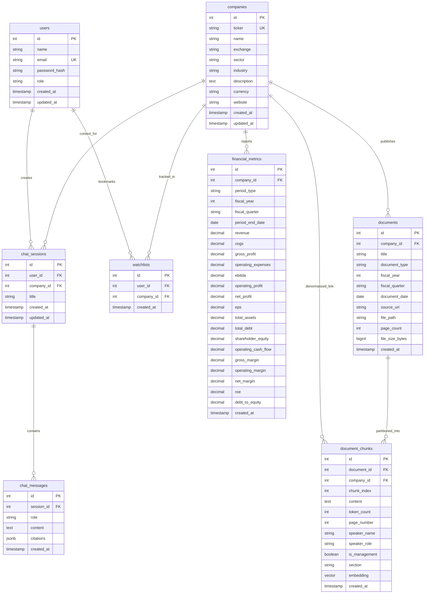

# Entity Relationship (ER) Diagram — AI Financial Research Terminal

This diagram illustrates the relational architecture of the PostgreSQL database, including foreign keys, cardinalities, and the vector storage integration.

---

## 1. Visual Entity Relationship Diagram

---

## 2. Cardinality Descriptions

1. **User to Chat Sessions (`1 : N`)**: A user can initiate many research chat sessions. Each chat session belongs to exactly one user.
2. **Chat Session to Chat Messages (`1 : N`)**: A chat session contains an ordered sequence of user prompts and AI responses. If a session is deleted, its messages cascade-delete.
3. **User to Watchlist (`1 : N`) & Company to Watchlist (`1 : N`)**: Represents the many-to-many relationship between users and companies they follow, with a unique constraint on `(user_id, company_id)`.
4. **Company to Financial Metrics (`1 : N`)**: A company has many quarterly and annual historical financial records.
5. **Company to Documents (`1 : N`)**: A company publishes many documents (Annual Reports, Transcripts, Filings).
6. **Document to Document Chunks (`1 : N`)**: A single document is segmented into multiple semantic chunks. Chunks inherit metadata (`company_id`, `speaker_name`, `page_number`) and contain the `vector(1536)` embedding.
